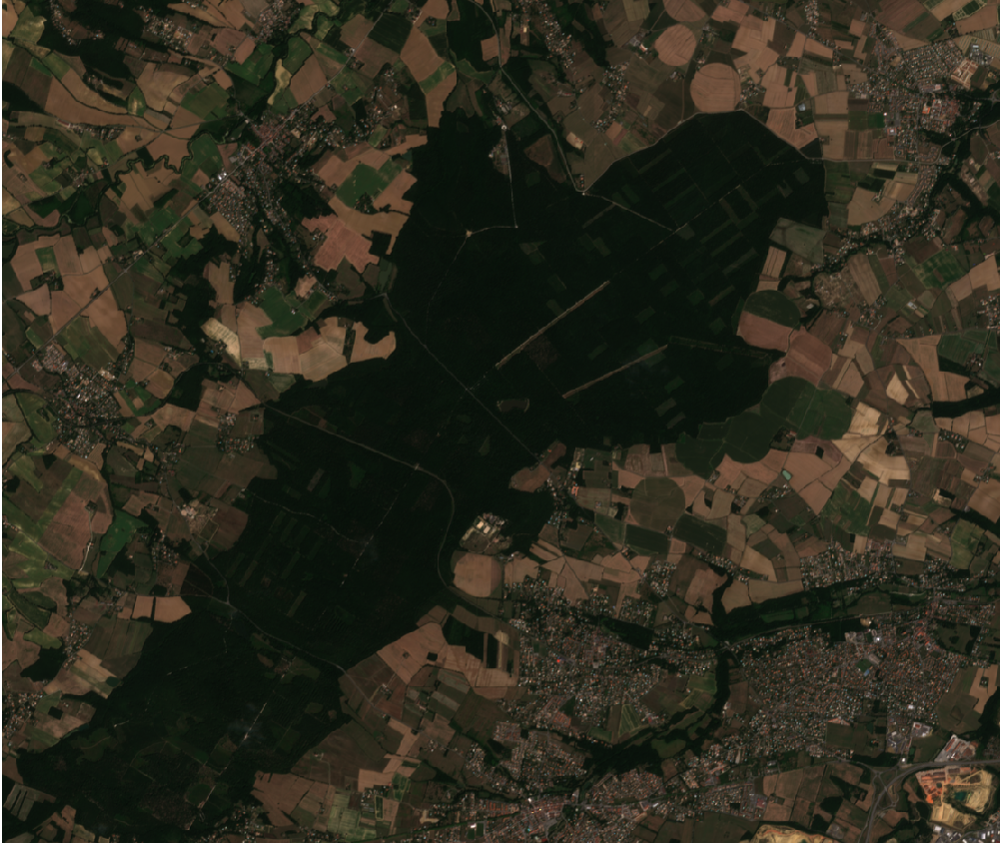
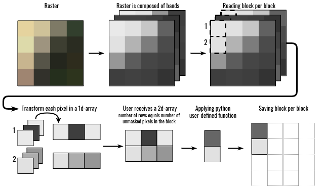
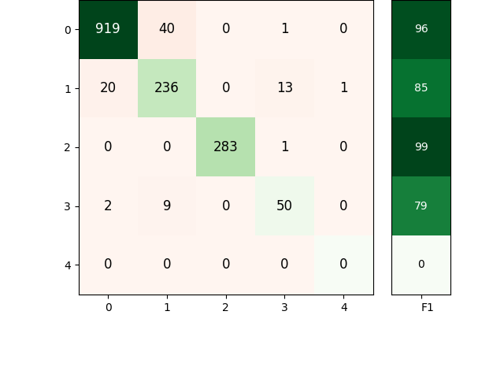

<!-- Global style -->
<style> img[alt~="center"] { display: block; margin: 0 auto; } </style>

Démonstration de MuseoToolBox
---


Comment faciliter les principaux traitements en télédétection ?

https://www.github.com/nkarasiak/atelier_SAGEO2019


###### Par [Nicolas Karasiak](https://www.karasiak.net/)


----

## Atelier télédétection python

:dart: L'objectif de cet atelier est :

- d'extraire les valeurs spectrales d'une image à partir d'un vecteur (point/polygone)
- de générer un indice spectral (type NDVI)  :chart_with_upwards_trend:
- créer un modèle à partir d'un algorithme de votre choix
- évaluer la qualité d'un modèle 👩‍💻
- prédire un modèle (raster, ou en générant à la volée un indice de type NDVI)

---

## Qu'est-ce que MuseoToolBox ?
MuseoToolBox est une bibliothèque dévelopée en python3 par [Nicolas Karasiak](https://www.karasiak.net).


---


## Installer MuseoToolBox
### Linux

```bash
python3 -m pip install museotoolbox --user
```
Pour mettre à jour:
```bash
python3 -m pip install museotoolbox --user -U
```

### Windows
Voir le tutorial ici : https://github.com/nkarasiak/atelier_SAGEO2019

---

## Télécharger le jeu de démo de l'atelier



- **raster** : synthèse août 2018 de Sentinel-2 (Theia)
- **vecteur** : Un jeu de données d'entrainements (8 classes)

À télécharger sur : https://git.io/Je28w

---

## Principe de rasterMath
rasterMath est la clé de voute de MuseoToolBox. Cette classe est utilisée pour lire et écrire sur les images de manière optimisée.

La plupart des utilisations d'un raster dans notre domaine se fait pixel par pixel, c'est-à-dire que l'on n'a pas besoin de l'information des pixels voisins, mais que l'on traite la plupart du temps un pixel avec l'ensemble de ses bandes. C'est par exemple le cas quand on calcule l'indice NDVI.

---

**rasterMath** permet donc de lire une image et de ne recevoir que l'information par lot de pixels :



 
 ---

 Ainsi, vous n'avez plus besoin de gérer :
 - la projection géographique 🗺️
 - l'ouverture et la fermeture de l'image 
 - la gestion des no-data ou encore la compression 🗜️
 - la lecture et l'écriture en parcourant l'image bloc par bloc 
 - le type de données GDAL (conversion automatique depuis le type de données de numpy)

:bulb: Vous vous concentrez uniquement sur votre traitement.
 
 ---

## Principe de rasterMath avec numpy

```python
import numpy as np
import museotoolbox as mtb

raster = 'sentinel2_31_20180815.tif'
# J'initialise l'instance rasterMath
rM = rasterMath(raster)

# Je demande un échantillon de mon image
X = rM.getRandomBlock()

# La dimension de l'échantillon
print(X.shape)
>>> (15840, 10)
# mon échantillon contient 15840 pixels de 10 bandes chacun
# J'affiche la totalité
print(X) 
 ```
 ---

 ## Principe de numpy

 ```python
 # Je veux pour chaque pixel la première bande
 X[:,0] 

 # Je veux pour le premier pixel l'ensemble des bandes
 X[0,:] 
 
 # Je veux diviser la bande 2 par la bande 1
 X[:,1] / X[:,0]
 # ou
 np.divide(X[:,1],X[:,0])
 
 ```

 ---
 
 ### Calcul d'un NDVI
 
 Supposons que nous voulons calculer un NDVI avec les bandes 3 et 4 (donc comme en python commence à compter à partir de 0, il s'agira des bandes 2 et 3) :

```python
 def calcul_ndvi(x):
 	    ndvi = np.divide((x[:,3]-x[:,2]),(x[:,3]+x[:,2]))
     return ndvi
```
Il ne reste plus qu'à donner cette fonction à rasterMath. Le seul argument obligatoire dans votre fonction est le premier argument qui est le tableau numpy qui vous sera donné par rasterMath.

---

### Tester votre code
Après avoir écrit votre fonction `calcul_ndvi`, il faut donc la tester.
Pour cela, on va donner à notre fonction un échantillon de notre image.

```python
# Je peux donc le donner à la fonction calcul_ndvi
calcul_ndvi(X)
```

Il faut maintenant l'ajouter à votre instance de rasterMath.

---

### Calculer et écrire le NDVI

```python

# Ajoute une fonction et un chemin pour écrire le résultat (fichier tif)
rM.addFunction(calcul_ndvi,'/tmp/ndvi.tif')

# Je lance le calcul et l'écriture
rM.run()
```
 Plus d'exemples sur : https://museotoolbox.readthedocs.io/en/latest/modules/raster_tools/museotoolbox.raster_tools.rasterMath.html
 
---

### Exercice : calculer l'indice de chlorophylle (LChloC)

Les bandes du fichier *sentinel2_3a_20180815.tif* sont ordonnées de la manière suivante : B2, B3, B4, B8, B5, B6, B7, B8A, B11, B12. 

L'indice de chlorophylle est le quotient du rededge 3 (B7) et le rededge 1 (B5).

---
### Solution
```python
import museotoolbox as mtb
rM = mtb.raster_tools.rasterMath(raster)

def calcul_LChloC(X):
    return np.divide(X[:,6],X[:,4])
# Je teste si cela fonctionne
X = rM.getRandomBlock()
print(calcul_LChloC(X)) 

# LChloC
rM.addFunction(calcul_LChloC,'/tmp/LChloC.tif')

# je lance le calcul
rM.run()
```
---

## Extraire les valeurs spectrales d'un vecteur

```python
import museotoolbox as mtb

raster = 'sentinel2_31_20180815.tif'
vector = 'ROI.gpkg'
# extraire uniquement les valeurs spectrales
X = mtb.raster_tools.getSamplesFromROI(raster,vector)

# extraire les valeurs spectrales et la valeur de la colonne 'class'
X,y = mtb.raster_tools.getSamplesFromROI(raster,vector,'class')

# extraire les valeurs spectrales et deux colonnes (exemple avec 2 fois 'class')
X,y,g = mtb.raster_tools.getSamplesFromROI(raster,vector,'class','group')
```
Exemple complet sur : https://museotoolbox.readthedocs.io/en/latest/auto_examples/raster_tools/extractRasterValues.html


---

## Principes de learnAndPredict

Permet de faire de l'apprentissage automatique depuis un raster ou un vecteur. Vous choisissez : 
- l'algorithme et ses paramètres
- la validation croisée
- l'indice de qualité (accord global, kappa)

---

### learnAndPredict gèrera 
- la standardisation des données
- la sauvegarde du modèle
- le calcul des indices de qualité de chaque pli (issu des validations croisées)
- le calcul de la matrice de confusion de chaque pli
- l'entrainement et la prédiction à partir d'une image ou d'un vecteur

---

## Préparation du modèle

```python
from sklearn.ensemble import RandomForestClassifier
classifier = RandomForestClassifier(random_state=12,n_jobs=1)

# initialisation de la classe avec 4 coeurs pour les validations croisées
# verbose=1 signifie qu'on aura des infos lors de l'apprentissage
mymodel = mtb.learn_tools.learnAndPredict(n_jobs=4,verbose=1)

# crée une validation croisée par groupe (LOO par groupe)
cv = mtb.cross_validation.LeaveOneSubGroupOut()
```

Plus d'exemples sur : https://museotoolbox.readthedocs.io/en/latest/modules/learn_tools/museotoolbox.learn_tools.learnAndPredict.html#museotoolbox.learn_tools.learnAndPredict

---

### Apprentissage à partir d'un vecteur
```python
X,y,group = mtb.raster_tools.getSamplesFromROI(raster,vector,'class','group')

# entrainement à partir d'un vecteur avec standardisation (centré/réduit)
mymodel.learnFromVector(X,y,group=group,cv=cv,
    classifier=classifier,
    param_grid=dict(n_estimators=[100,200]),
    standardize=True)

# prédiction d'un raster (même nombre de bandes que le tableau X)
mymodel.predictRaster(raster,'classification.tif')
```
---
### Apprentissage à partir d'un raster
```python
# entrainement à partir d'un raster
mymodel.learnFromRaster(raster,vector,'Class',cv=5,
    classifier=classifier,
    param_grid=dict(n_estimators=[100,200]),
    standardize=True)

# prédiction d'un raster
mymodel.predictRaster(raster,'classification.tif')
```

---

## Estimer la qualité du modèle

```python
CM = []
OA = []
for statsPerCv in mymodel.getStatsFromCV(kappa=True,OA=True):
    CM.append(statsPerCv['confusionMatrix'])
    OA.apppend(statsPerCv['OA'])

# Accord global moyen
print(np.mean(OA))
```
---

## Calculer la matrice de confusion moyenne et le F1

```python

from museotoolbox import charts
from matplotlib.pyplot import cm as colorMap
# average cm
meanCM = np.mean(CM,axis=0).astype(np.int16)
# Translate for Y = prediction and X = truth
pltCM = charts.plotConfusionMatrix(meanCM.T) 
# add value for each cell
pltCM.addText()
# add F1
pltCM.addF1()
```
---
# Résultat


---

## Apprentissage à partir d'un indice généré à la volée
```python 
mymodel = mtb.learn_tools.learnAndPredict(n_jobs=4,verbose=1)

# toutes les données en entrée seront converties selon votre fonction
mymodel.customizeX(calcul_LChloC)

# le reste de la procédure est identifique
mymodel.learnFromVector(X,y,group=group,cv=cv,
    classifier=classifier,
    param_grid=dict(n_estimators=[100,200]),
    standardize=True)

# prédiction d'un raster (même nombre de bandes que le tableau X)
mymodel.predictRaster(raster,'classification_LChloC.tif')
```

---

## Créer un masque à partir d'un vecteur

```python
# par défault, seuls les polygons sont non masqués 
museotoolbox.raster_tools.rasterMaskFromVector(vector,raster,'/tmp/mask.tif')

# si vous voulez masquer uniquement les polygones 
museotoolbox.raster_tools.rasterMaskFromVector(vector,raster,'/tmp/mask.tif',invert=True)

```

